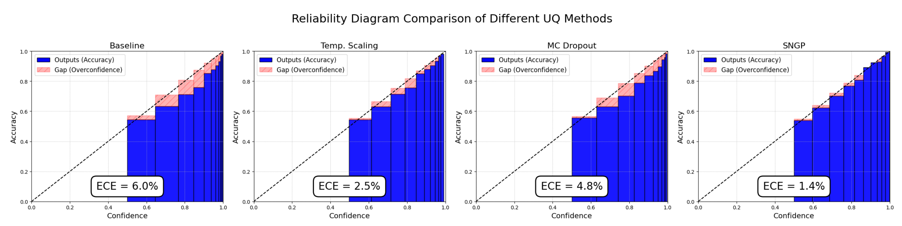
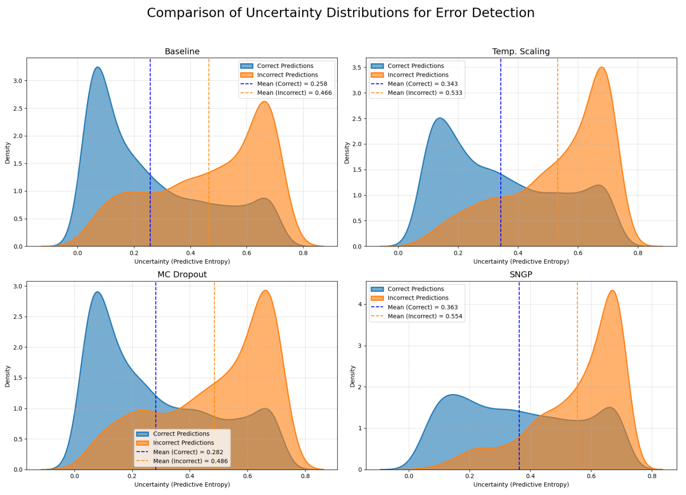
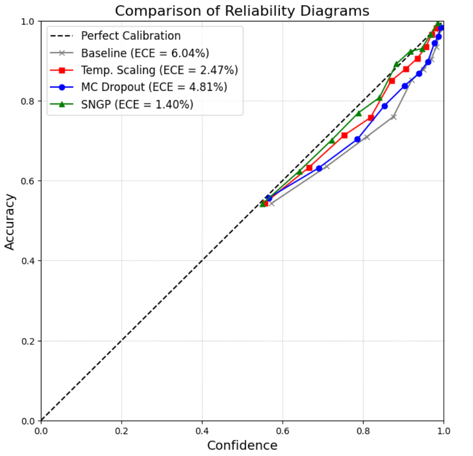
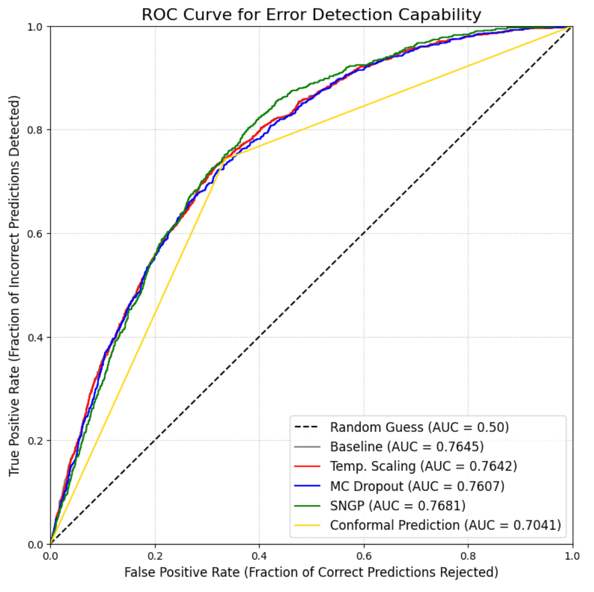

# Uncertainty-Sentiment-Analysis
# 社交媒体情绪不确定性的定量分析 
基于社交媒体评论的情绪分析场景，对基线模型进行调优，并基于基线模型开展4中不确定性量化方法的研究，得出量化结果后进行横向比较并提供可视化分析。项目结构参照info.txt。

Based on the sentiment analysis scenario of social media comments, optimize the baseline model and conduct research on four uncertainty quantification methods based on the baseline model. After obtaining the quantification results, conduct horizontal comparison and provide visual analysis. The project structure is based on info. txt.

|  |  |
|---|---|
|任务类型 / Task Type|分类 / Classification|
|基线模型 / Baseline Model|DistilBERT|
|基线模型链接 / Baseline Model Link|https://huggingface.co/distilbert/distilbert-base-uncased|
|数据集 / Dataset|stanfordnlp/sentiment140|
|数据集链接 / Dataset Link|https://huggingface.co/datasets/stanfordnlp/sentiment140|
|运行设备 / Operating Equipment|T4 GPU on Google Colab|

研究中相关图示 / Related illustrations in the study：

